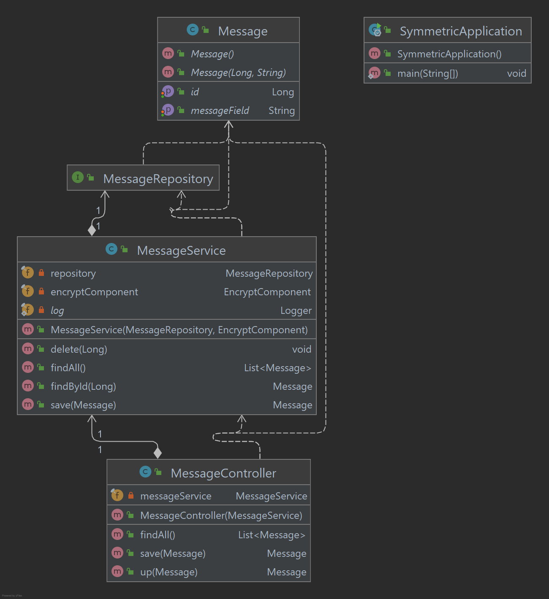

## Criptografia Simétrica e Assimétrica

## Sobre este Repositório

Este é um repositório de exemplo de implementação de modulos rest que criam mensagens simples utilizando criptografias simetricas e assimetricas

A criptografia é o estudo dos princípios e técnicas pelos quais as informações podem ser convertidas de sua forma
original. Para o outro é ilegível.

### Criptografia Simétrica

É projetada para usar uma única chave, tanto para criptografia quanto para a descriptografia.

### Criptografia Assimétrica

Se você criptografar o texto com a chave privada, só poderá descriptografá-lo com a chave pública e vice-versa.

### Combinando Criptografia Simétrica e Assimétrica

Somente o uso de criptografia simétrica tem o problema de como compartilhar a chave privada com o receptor, uma solução
para esse problema é usar uma combinação de criptografia simétrica e assimétrica.

#### Diagrama de Classe Core

#### Diagrama de Classe Symmetric

#### Diagrama de Classe Asymmetric

### Instalação

### Licença

### Status do Projeto
